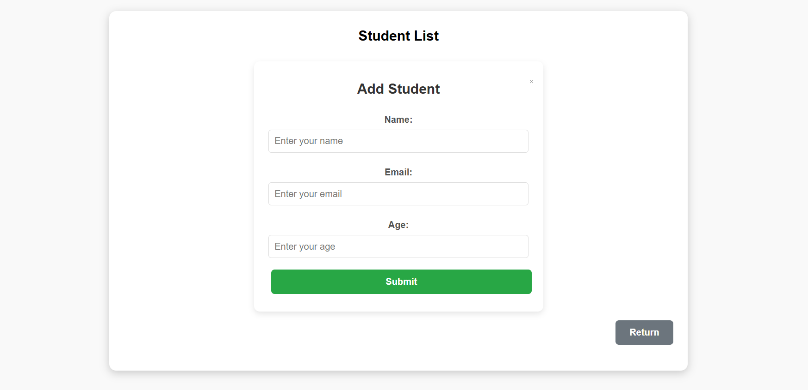

# Student Management App

This is a simple React application for managing student information, including adding, editing, and deleting students. The application interacts with a backend API using Axios to perform CRUD operations.

## Features

- View a list of students in a table.
- Add new students with name, email, and age fields.
- Edit existing student details.
- Delete students from the list.
- Responsive UI with a user-friendly interface.

## Tech Stack

**Frontend:**
ReactJS for building the UI,
React Icons for icons and
CSS for styling.

**Server:**  Node.js and Express.js

**HTTP Client:** Axios for API communication

## How to Use
**Viewing Students:** 
Launch the app to see the current list of students in a table.

**Adding a Student:** 
Click the "Add New Student" button.
Fill in the details in the form.
Click Submit to add the student.

**Edit Student:**
Click the "Edit" button for a student in the table.
Modify the details in the form.
Click Update to save changes.

**Delete Student:**
Click the "Delete" button for a student in the table.
Confirm the action.

## Screenshots

### Home Page

### Add Student Form

